# End-to-End Data Engineering project with Snowflake, dbt and Airflow

## Overview
This project implements a modern data engineering pipeline using Snowflake, dbt (data build tool), and Apache Airflow. The pipeline orchestrates data transformation and loading processes, ensuring efficient and reliable data workflows.

## Tech Stack
- **Snowflake**: Cloud data warehouse for storing and processing data
- **dbt**: Handles data transformation and modeling
- **Apache Airflow**: Orchestrates pipeline scheduling and monitoring

## Architecture
The pipeline follows a modern ELT (Extract, Load, Transform) approach:
1. Data is loaded into Snowflake
2. dbt models transform the raw data into analytics-ready tables
3. Airflow manages the scheduling and execution of these processes

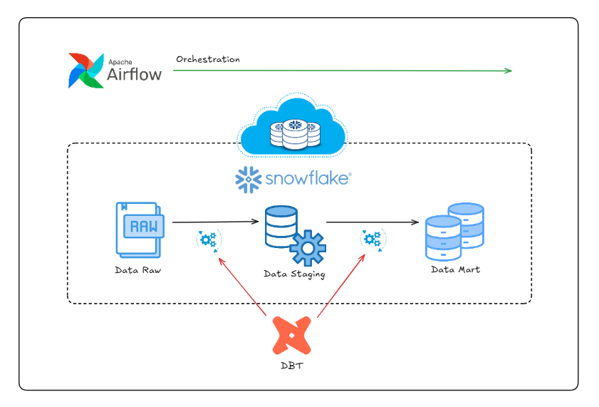

## Prerequisites

**Snowflake Account**
1. Setup a Snowflake account

2. Steps mentioned in the sql workbook to create role/warehouse/db/schema

**Installing DBT in local**
1. Refer docs - https://docs.getdbt.com/docs/core/pip-install
2. Create the environment for DBT: **python -m venv dbt-env**
3. Activate the environment for Windows: dbt-env\Scripts\activate
 
Note: dbt connects to and runs SQL against your database, warehouse, lake, or query engine.
These SQL-speaking platforms are collectively referred to as data platforms.
dbt connects with data platforms by using a dedicated adapter plugin for each, in this case Snowflake.
 
4. use the dbt-env virtual environment
5. Install Snowflake adapter: **pip install dbt-snowflake**
6. Install DBT core: **pip install dbt-core**
7. Initialise: dbt init -> name: dbt_data_pipeline -> choose snowflake as the warehouse -> get account details from snowflake -> fill the details for role/warehouse/db/schema

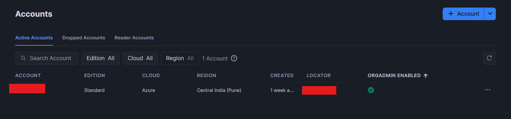

Note: new folder **dbt_data_pipeline** will be created.

**Install Docker Desktop**
- Docker Desktop - https://www.docker.com/products/docker-desktop/
Note: Please do a system restart/ it will ask to restart to set admin privileges

## CONFIGURE dbt_project.yml and packages
1. dbt_project.yml is the main file for reference to find models/tests
2. we will create two dir -> staging(store raw data) and marts(store the transformed data)

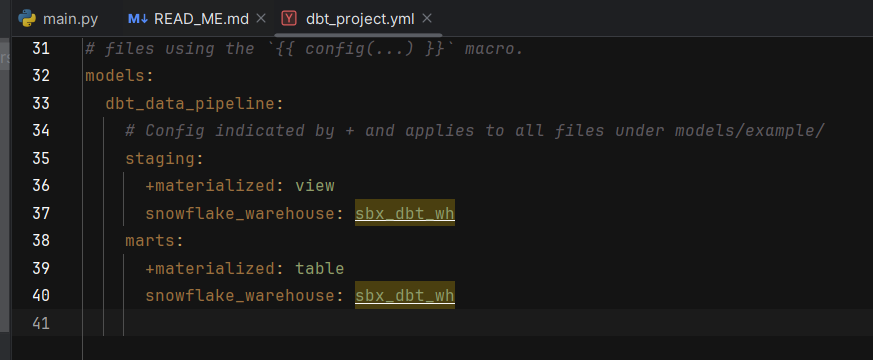
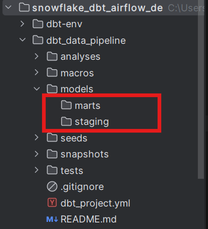

3. install third party libraries in new file packages.yml(dbt-labs/dbt_utils) and run **dbt deps**

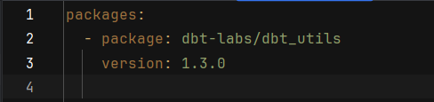

Note: change the directory where dbt_project.yml file is present to run dbt deps and new folder dbt_packages is created.

## Create source and staging files
1. create a new dir(dbt_sources) for tpch_sources.yml to configure the source table already available in snowflake

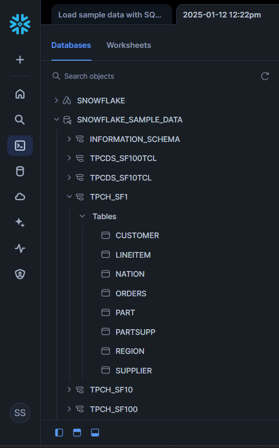

2. Create tables in staging and marts as sql files
3. run and test dbt

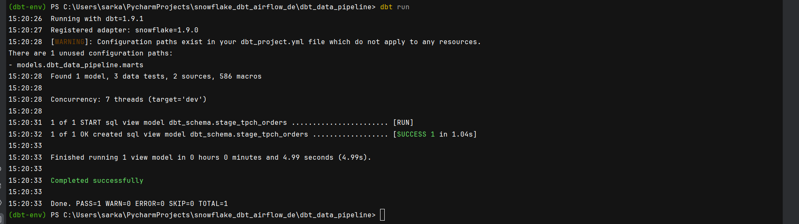
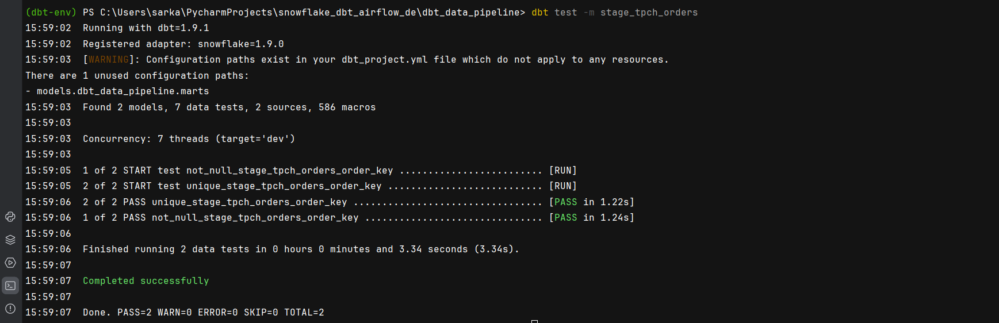

Note: Errors I faced during dbt run and make sure the params for the profiles.yml are configured correctly.
1. 250001: Could not connect to Snowflake backend after 2 attempt(s).Aborting
Resolved - https://stackoverflow.com/questions/78740921/250001-could-not-connect-to-snowflake-backend-after-2-attempts-aborting
2. SSLError CertificateError when attempting to connect to Snowflake over the account locator URL
https://community.snowflake.com/s/article/SSLError-CertificateError-when-attempting-to-connect-to-Snowflake-over-the-account-locator-URL

## Transformed models (fact tables, dimensions tables and data mart)
- To understand more about fact tables, dimensions tables and data modelling concepts - https://www.kimballgroup.com/data-warehouse-business-intelligence-resources/kimball-techniques/dimensional-modeling-techniques/

1. create fact tables based on the staging tables in marts
2. D.R.Y and create macros under macros folder
3. write singular and generic dbt tests under **_{dir}_model.yml** file

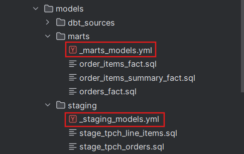

4. if you need to add singular tests add under the tests folder

5. ensure all the tests pass successfully

Note: once you run the models the tables will be created under the same database and schema.
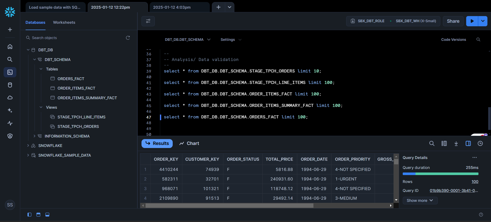

## Deploy models using Apache Airflow
- We will be using Astonomer cosmos to deploy Airflow Dags with docker - https://github.com/astronomer/astronomer-cosmos

1. Astro CLI Docs - https://www.astronomer.io/docs/
2. Open CMD Prompt -> Install astro using - winget install -e --id Astronomer.Astro (for Windows)
3. Create a new directory -> dbt-dag -> change to dbt-dag directory

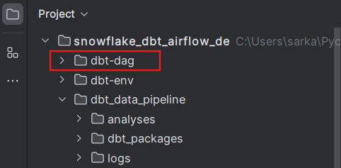

4. Initialise astro -> astro dev init

Note - It will create the dependencies for Docker inside dbt-dag

5. Before starting the astro dev, we need to specify few deps:
   1. Update Dockerfile
   
   RUN python -m venv dbt_venv && source dbt_venv/bin/activate && pip install --no-cache-dir dbt-snowflake && deactivate

   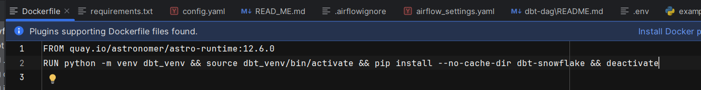

   2. Update requirements.txt
   
   astronomer-cosmos[dbt.snowflake]

   apache-airflow-providers-snowflake

   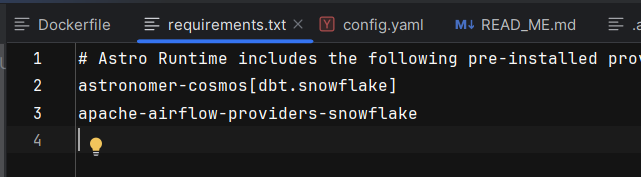

6. Change to dbt-dag directory in CMD Prompt -> Start astro -> astro dev start

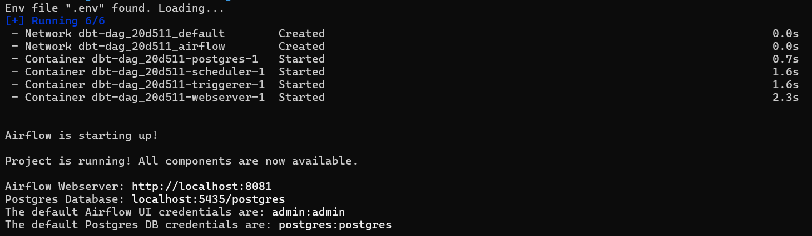

Note: If any error faced due to ports, please configure the ports correctly

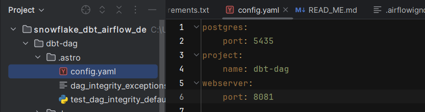

7. Airflow will run on the localhost:8080/ localhost:<specified port> with account:admin & password: admin

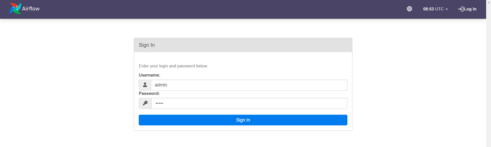

8. Configure the connection between Snowflake and Airflow

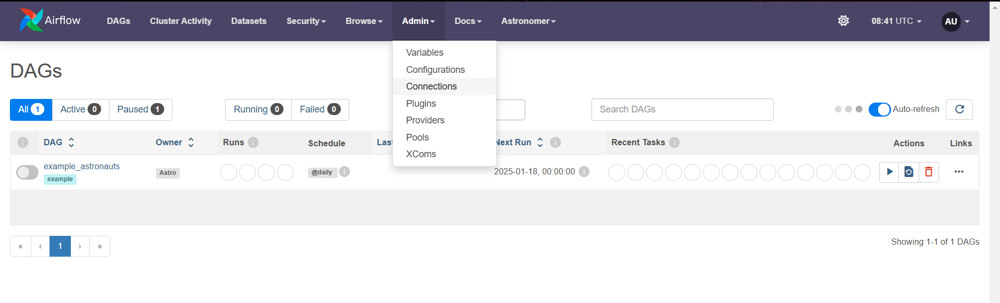
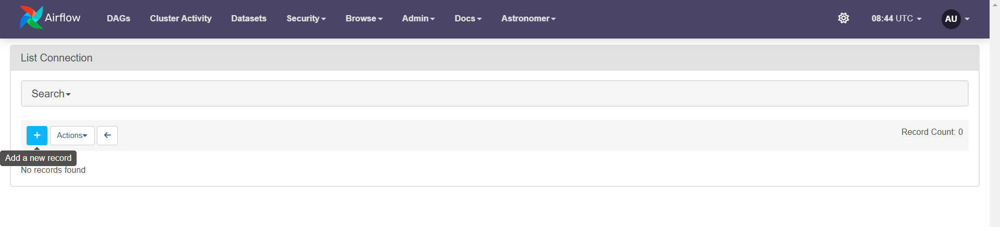
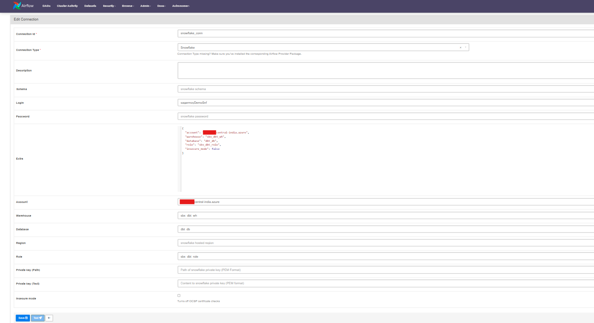

9. Copy paste the dbt_data_pipeline folder under dbt-dag/dags by creating a new folder dbt

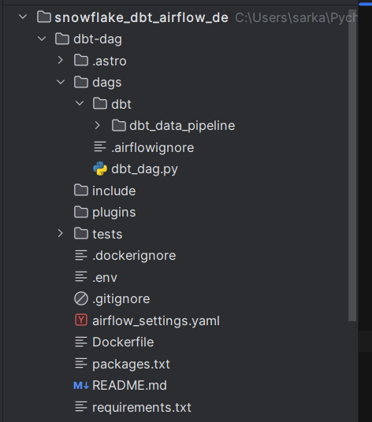

10. Configure the dbt_dag.py to build the data pipelines
11. Refresh the Airflow UI, to see the new dag created

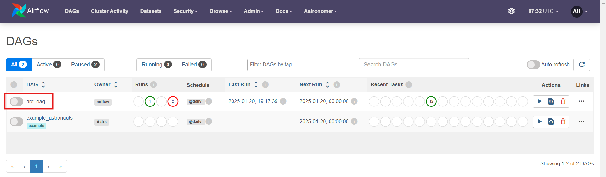

12. Trigger the dag to run and test the dbt model in Airflow to create the tables in Snowflake

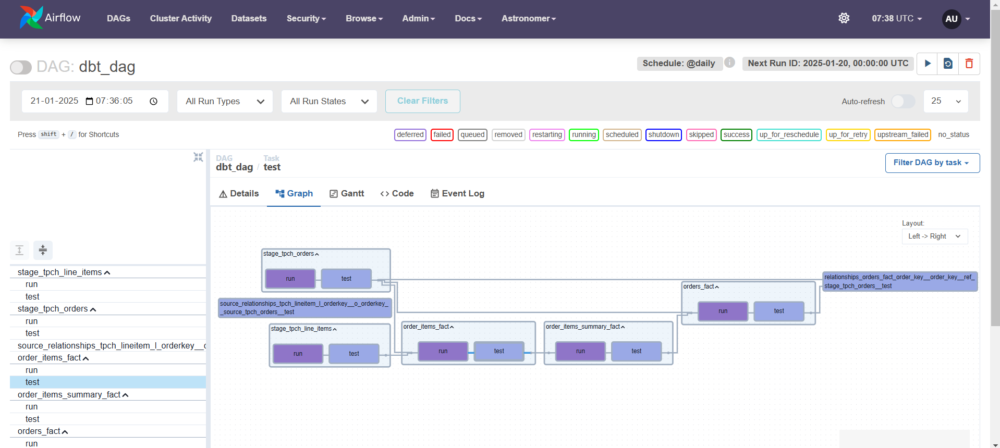

